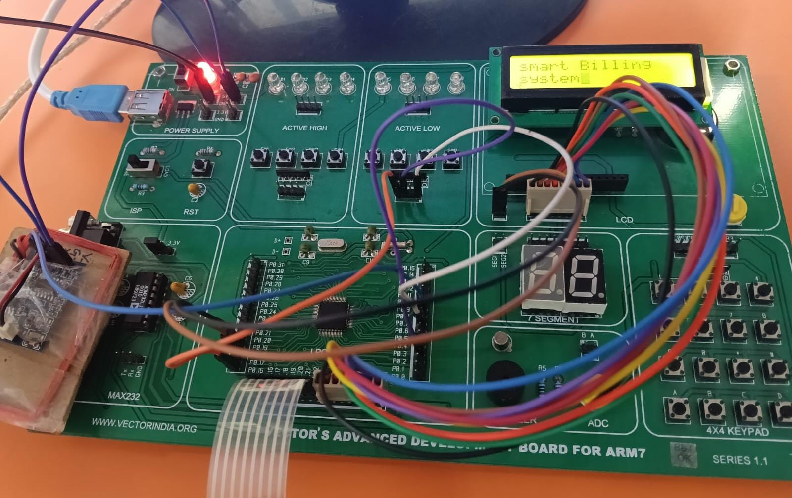
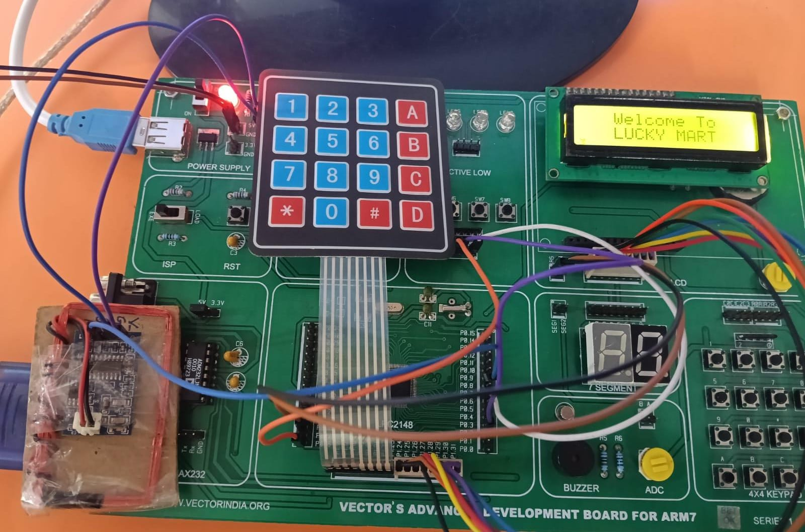
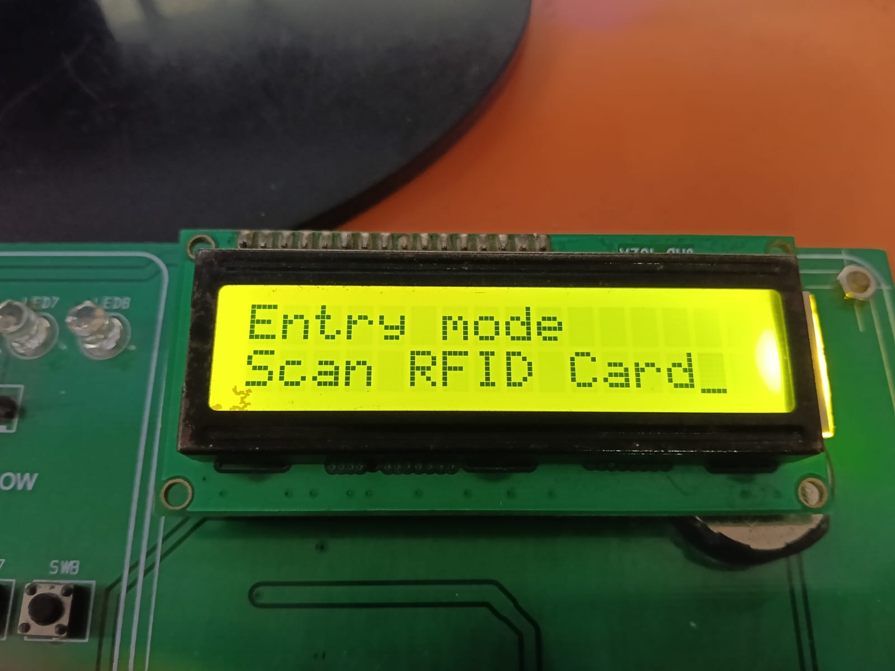
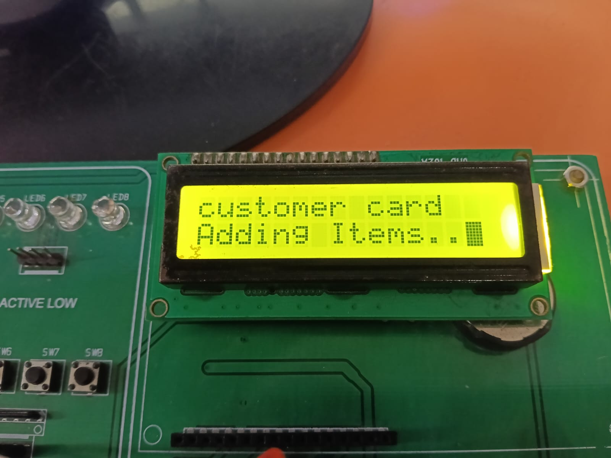
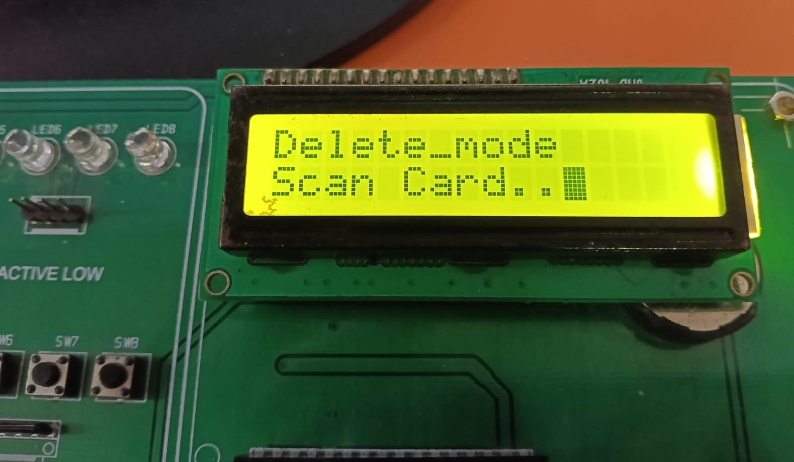
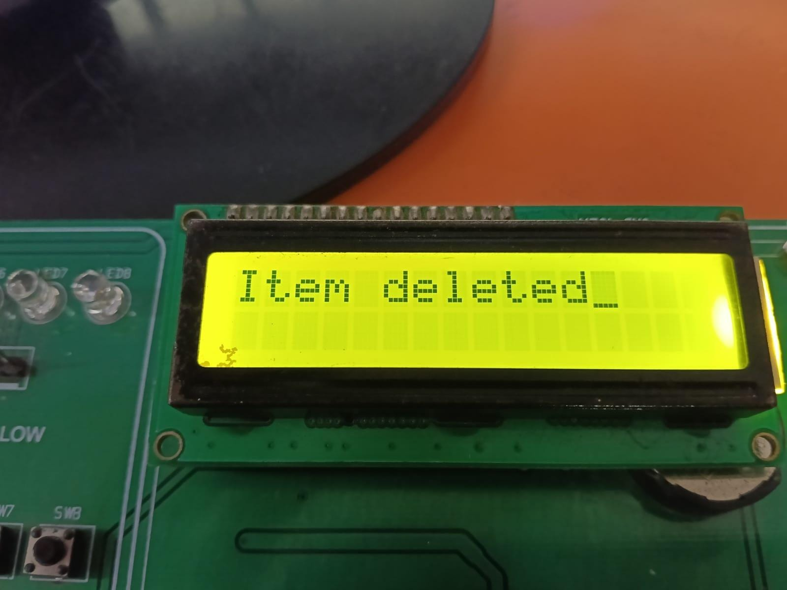
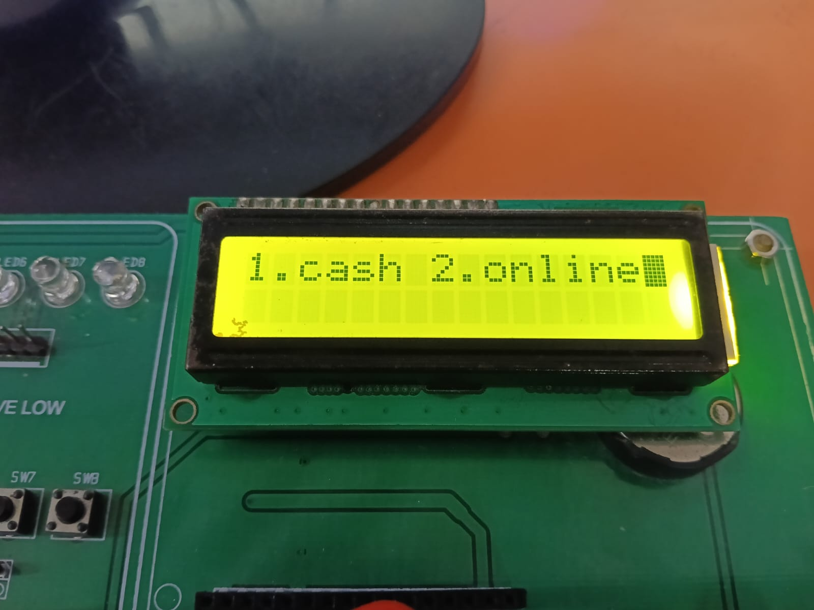
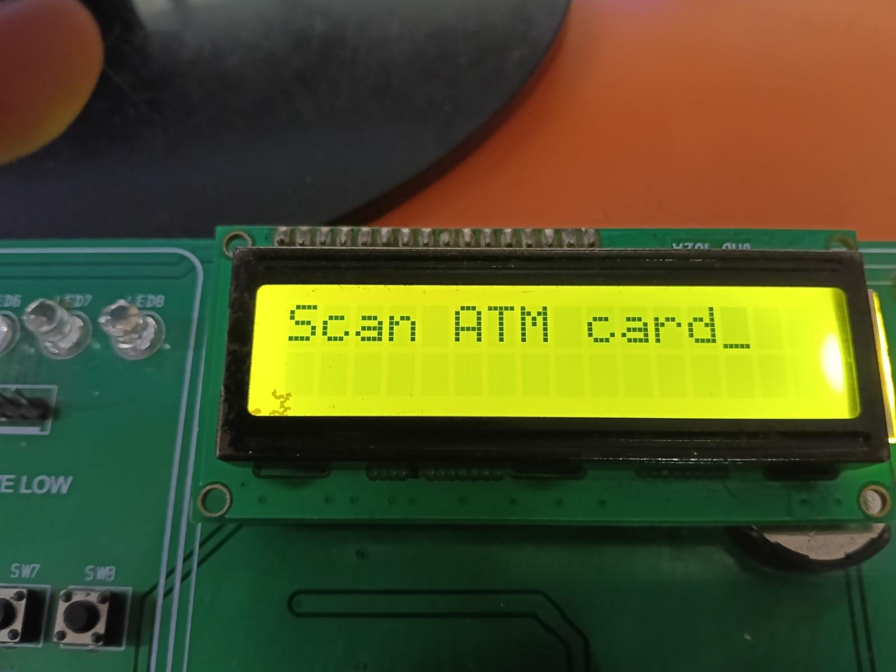

# 🛒 SmartCart: RFID Smart Billing System

<p align="center">


</p>

---

# 📖 Overview

**SmartCart: RFID Smart Billing System** is an embedded automation project designed to simplify the shopping and billing process using **RFID technology** and **database integration**.

The project consists of two applications:

- **Embedded firmware** running on the LPC2148 ARM7 microcontroller.
- **Linux C application** that communicates with the hardware through UART and maintains product and bank databases.

Customers simply scan RFID-tagged products to add or remove items from the cart. The system automatically calculates the total bill, updates inventory, and supports both **Cash** and **ATM Card** payment methods.

---

# 🎯 Objectives

- Develop an automated shopping cart using RFID.
- Reduce manual billing time.
- Maintain product inventory automatically.
- Support secure ATM card payment.
- Communicate with Linux database using UART.
- Provide an efficient smart shopping experience.

---

# ✨ Features

- RFID-based product identification
- Automatic product billing
- LCD display interface
- 4×4 Matrix keypad input
- Inventory management
- Manager mode for stock updates
- Item deletion support
- Cash payment
- ATM card payment
- PIN authentication
- Three-attempt PIN security
- UART communication
- Linux database integration

---

# 🏗️ System Architecture

<p align="center">


</p>

---

# 📦 Block Diagram

<p align="center">


</p>

---

# ⚙️ Hardware Components

| Component | Description |
|------------|-------------|
| LPC2148 ARM7 | Main Controller |
| RFID Reader | Reads RFID tags |
| RFID Cards | Product / Manager / ATM Cards |
| 16×2 LCD | Displays menu and billing |
| 4×4 Matrix Keypad | User input |
| MAX232 | Serial Communication |
| USB-UART Converter | PC Communication |
| Push Buttons | Entry, Delete, Exit |

---

# 💻 Software Requirements

- Embedded C
- Linux C Programming
- Keil μVision
- Flash Magic
- GCC Compiler
- UART Communication

---

# 🔌 Hardware Interfaces

| Peripheral | Interface |
|------------|-----------|
| RFID Reader | UART1 |
| Linux PC | UART0 |
| LCD | GPIO |
| Keypad | GPIO |
| Switches | External Interrupts |

---

# 🔄 Working Principle

## Entry Mode

1. Press **Entry Button (EINT0)**.
2. Scan Manager Card or Product Card.
3. Product details are sent to Linux through UART.
4. Linux searches the database.
5. Product price and stock are returned.
6. LCD displays product information.
7. Total bill is updated automatically.

---

## Delete Mode

1. Press Delete Button.
2. Scan product card.
3. Product is removed from cart.
4. Inventory is restored.
5. Total amount is updated.

---

## Exit Mode

1. Press Exit Button.
2. Payment menu appears.

```
1. Cash
2. Card
```

---

## Cash Payment

- Enter total amount.
- Payment completed.
- Shopping session ends.

---

## ATM Card Payment

1. Scan ATM card.
2. Card number and bill amount sent to Linux.
3. Enter 4-digit PIN.
4. PIN verified using bank database.
5. Payment successful if authenticated.
6. Maximum 3 incorrect attempts allowed.
7. If authentication fails, payment is cancelled and inventory is restored.

---

# 💳 Payment Workflow

<p align="center">


</p>

---

# 📂 Database Structure

## Stock Database

| Item | RFID Card | Quantity | Price |
|------|-----------|----------|------|
| Soap | 00332069 | 190 | ₹100 |
| Milk | 00336463 | 95 | ₹50 |
| Chips | 00312472 | 26 | ₹10 |

---

## Bank Database

| Bank | Account | Balance | PIN |
|------|----------|----------|------|
| VECTOR Bank | 12638754 | ₹10000 | 1234 |

---

# 📡 UART Communication

The system uses two UART channels.

### UART0

- LPC2148 ↔ Linux PC

### UART1

- RFID Reader ↔ LPC2148

---

# 📜 RFID Communication Format

### Product Card

```
CCARDNUMBER$
```

Example

```
C00332069$
```

---

### Manager Card

```
MCARDNUMBER$
```

---

### Delete Product

```
DCARDNUMBER$
```

---

### ATM Card Payment

```
BCARDNUMBERAMOUNT$
```

---

### RFID Reader Output

Example RFID data:

```
0x02
0x31
0x32
0x33
0x34
0x35
0x36
0x37
0x38
0x03
```

---

# 🔄 Software Flow

<p align="center">


</p>

---

# 📸 Project Gallery

<p align="center">
















</p>

---

# 🚀 Future Enhancements

- Barcode Scanner Support
- QR Code Billing
- Mobile Application
- Cloud Database
- Online Payment Gateway
- IoT-Based Monitoring
- Automatic Discount Coupons
- Digital Receipt Generation
- Voice Assistance
- Wi-Fi Enabled Smart Cart

---

# 🌍 Applications

- Supermarkets
- Shopping Malls
- Retail Stores
- Smart Shopping Systems
- Automated Billing Counters
- Inventory Management

---

# 📁 Project Structure

```
SmartCart-RFID-System/
│
├── Embedded_Code/
├── Linux_Code/
├── Database/
│   ├── stock.txt
│   └── bank.txt
├── images/
├── README.md
└── LICENSE
```

---

# 🛠 Technologies Used

- Embedded C
- Linux C
- LPC2148 ARM7
- UART Communication
- RFID Technology
- Embedded Linux
- Database Integration

---

# 👩‍💻 Author

**Karne Archana**

Bachelor of Technology (Electronics and Communication Engineering)

**Skills**

- Embedded Systems
- Embedded C
- ARM7 LPC2148
- Embedded Linux
- UART Communication
- RFID Systems

---

# 📄 License

This project is developed for **educational and learning purposes**.

---

## ⭐ Support

If you found this project helpful, please **⭐ Star** the repository and share your feedback!
